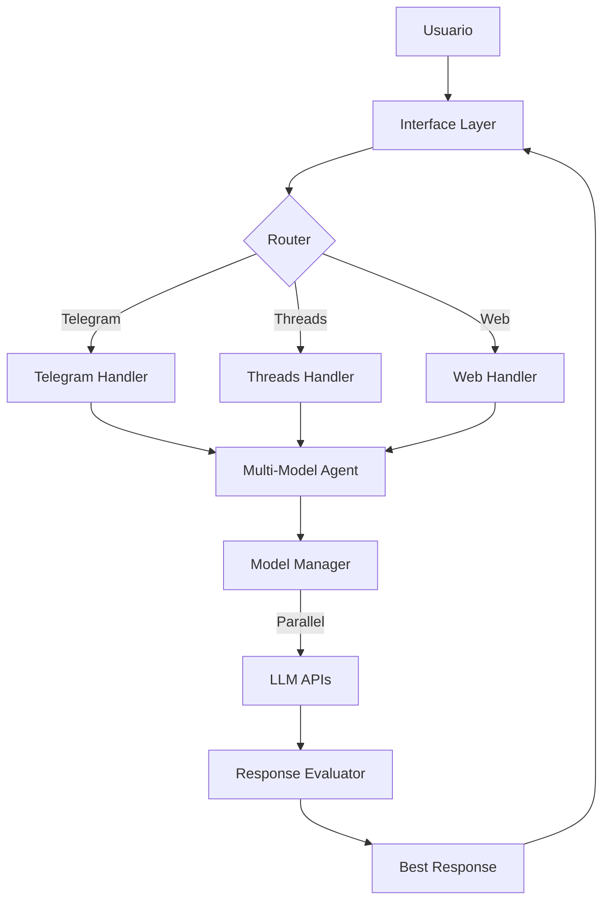
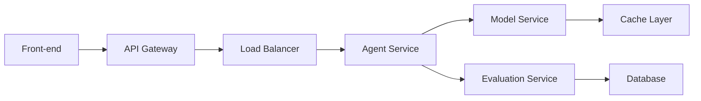

# Especificación Técnica: Plataforma Multi-Modelo de Agentes IA

## Resumen Técnico
Este documento detalla la arquitectura y especificaciones técnicas de una plataforma de agentes IA que integra múltiples modelos de lenguaje, con capacidades de interacción a través de Telegram y Threads, incluyendo un sistema sofisticado de evaluación y comparación de respuestas.

## Arquitectura del Sistema

### 1. Core Agent System (`src/agents/`)

#### 1.1 BaseAgent (base_agent.py)
```python
class BaseAgent(ABC):
    - Gestión de estado base para todos los agentes
    - Sistema de historial de conversaciones
    - Interfaz abstracta para procesamiento de mensajes
    - Manejo de errores estandarizado
    - Validación de respuestas
```

#### 1.2 MultiModelAgent (multi_model_agent.py)
```python
class MultiModelAgent(BaseAgent):
    - Procesamiento paralelo de consultas en múltiples modelos
    - Sistema de evaluación y comparación de respuestas
    - Selección automática de mejor respuesta
    - Gestión de errores específica para múltiples modelos
    - Interfaz de comparación de respuestas
```

### 2. Sistema de Evaluación (`src/evaluators/`)

#### 2.1 ResponseEvaluator
```python
class ResponseEvaluator:
    Criterios de Evaluación:
    - Precisión (40%): Evaluación de exactitud de respuestas
    - Coherencia (30%): Análisis de estructura y lógica
    - Relevancia (20%): Similitud semántica con la pregunta
    - Tiempo de respuesta (5%): Eficiencia temporal
    - Uso de tokens (5%): Eficiencia de recursos
```

### 3. Configuración del Sistema

#### 3.1 Variables de Entorno
```env
# Configuración de APIs
- API Keys para múltiples proveedores de LLM
- Tokens de acceso para plataformas

# Configuración de Modelos
- Modelo predeterminado y de respaldo
- Parámetros de generación

# Configuración de Evaluación
- Criterios y umbrales mínimos
- Pesos de evaluación

# Configuración de Infraestructura
- Configuración de base de datos
- Configuración de caché
- Parámetros de logging
```

### 4. Flujo de Datos
1. **Entrada de Mensajes**
   - Recepción desde múltiples fuentes (Telegram, Threads, Web)
   - Validación y normalización de inputs

2. **Procesamiento**
   - Distribución a múltiples modelos
   - Procesamiento paralelo de respuestas
   - Evaluación y comparación

3. **Evaluación**
   - Análisis multi-criterio
   - Cálculo de puntuaciones ponderadas
   - Selección de mejor respuesta

4. **Respuesta**
   - Formateo de respuesta
   - Envío al canal apropiado
   - Almacenamiento en historial

### 5. Integración con Threads
```python
class ThreadsConnector:
    Funcionalidades:
    - Autenticación con la API de Threads
    - Publicación y lectura de mensajes
    - Gestión de hilos y respuestas
    - Manejo de rate limiting específico
    - Sistema de caché para respuestas frecuentes
```

### 6. Sistema de Caché y Optimización
```python
class CacheManager:
    Características:
    - Caché distribuido con Redis
    - Invalidación inteligente de caché
    - Estrategias de precarga
    - Compresión de datos
    - Métricas de hit/miss ratio
```

## Especificaciones Técnicas

### 1. Requisitos del Sistema
- Python 3.8+
- Redis (para caché)
- SQLite/PostgreSQL (para almacenamiento)
- Memoria RAM: 4GB mínimo recomendado
- Almacenamiento: 10GB mínimo recomendado

### 2. Dependencias Principales
```python
# Core
langchain==0.0.314
langchain-community==0.0.16
langchain-core==0.1.4

# LLM APIs
openai==1.3.0
anthropic==0.5.0
cohere-api==1.6.0
google-generativeai==0.3.1

# Conectores
python-telegram-bot==20.6
tweepy==4.14.0

# Evaluación y Procesamiento
numpy
sentence-transformers==2.2.2
```

### 3. Seguridad y Rate Limiting
- JWT para autenticación
- Rate limiting por usuario y modelo
- Límites de tokens diarios
- Validación de inputs
- Sanitización de respuestas

### 4. Monitoreo y Logging
- Nivel de log configurable
- Rotación de logs
- Métricas de rendimiento
- Alertas automáticas

## Guía de Implementación

### 1. Configuración Inicial
```bash
# Instalación
python -m venv venv
source venv/bin/activate
pip install -r requirements.txt

# Configuración
cp .env.example .env
# Configurar variables de entorno
```

### 2. Uso del Sistema
```python
# Ejemplo de uso básico
agent = MultiModelAgent()
result = await agent.compare_responses(
    "¿Cuál es la mejor manera de implementar un sistema de caché?",
    models=["gpt-4", "claude-2", "command-nightly"]
)
```

### 3. API de Telegram
Comandos disponibles:
- `/ask [pregunta]`: Consulta estándar
- `/compare [pregunta]`: Comparación multi-modelo
- `/models`: Listar modelos disponibles
- `/configure`: Configuración de preferencias

## Métricas de Evaluación

### 1. Criterios de Calidad
- Precisión técnica (accuracy)
- Coherencia del texto
- Relevancia contextual
- Eficiencia temporal
- Uso de recursos

### 2. Umbrales Mínimos
```python
MIN_ACCURACY_SCORE = 0.7
MIN_COHERENCE_SCORE = 0.6
MIN_RELEVANCE_SCORE = 0.6
```

## Próximas Mejoras

### 1. Optimizaciones Técnicas
- [ ] Implementación de caché distribuido
- [ ] Mejora del sistema de embeddings
- [ ] Optimización de procesamiento paralelo

### 2. Nuevas Funcionalidades
- [ ] Soporte para más modelos de lenguaje
- [ ] Sistema de retroalimentación de usuarios
- [ ] Análisis avanzado de respuestas

### 3. Mejoras de Infraestructura
- [ ] Escalado horizontal
- [ ] Redundancia y failover
- [ ] Optimización de costos

## Consideraciones de Seguridad
1. Protección de API keys
2. Validación de inputs
3. Rate limiting
4. Autenticación y autorización
5. Sanitización de outputs
6. Monitoreo de uso

## Licencia
MIT License 

## Diagramas de Arquitectura

### 1. Diagrama de Flujo del Sistema


### 2. Diagrama de Componentes


## Gestión de Errores y Recuperación

### 1. Estrategias de Fallback
- Modelo de respaldo automático
- Reintentos con backoff exponencial
- Circuito breaker para APIs externas
- Caché de últimas respuestas válidas

### 2. Monitoreo de Salud
```python
class HealthMonitor:
    Métricas:
    - Latencia por modelo
    - Tasa de errores
    - Uso de recursos
    - Disponibilidad de APIs
    - Estadísticas de caché
```

## Optimización de Costos

### 1. Estrategias de Reducción de Costos
- Selección inteligente de modelos según complejidad
- Caché agresivo para consultas frecuentes
- Compresión de tokens
- Batch processing cuando sea posible

### 2. Métricas de Costo
```python
class CostTracker:
    Métricas:
    - Costo por consulta
    - Costo por modelo
    - ROI de caché
    - Optimización de tokens
```

## Pruebas y Calidad

### 1. Suite de Pruebas
```python
# Test Suites
- Unit Tests
- Integration Tests
- Load Tests
- Security Tests
- API Tests
```

### 2. Métricas de Calidad
- Cobertura de código
- Tiempo de respuesta
- Precisión de respuestas
- Satisfacción de usuario

## Despliegue y Escalabilidad

### 1. Estrategia de Despliegue
```bash
# Pasos de Despliegue
1. Validación de dependencias
2. Pruebas automatizadas
3. Despliegue en staging
4. Pruebas de integración
5. Despliegue en producción
```

### 2. Configuración de Escalado
```yaml
scaling:
  min_instances: 2
  max_instances: 10
  cpu_threshold: 70%
  memory_threshold: 80%
  cooldown_period: 300s
```

## Mantenimiento y Actualizaciones

### 1. Procedimientos de Mantenimiento
- Actualizaciones de modelos
- Optimización de caché
- Limpieza de datos
- Actualización de dependencias

### 2. Ventanas de Mantenimiento
- Programación de actualizaciones
- Procedimientos de rollback
- Comunicación con usuarios

## Apéndices

### A. Glosario de Términos
- LLM: Large Language Model
- Token: Unidad básica de procesamiento
- Embedding: Representación vectorial
- Prompt: Entrada de texto al modelo

### B. Referencias
- Documentación de LangChain
- APIs de modelos de lenguaje
- Mejores prácticas de seguridad
- Estándares de evaluación de IA 